<div align="center">
  
</div>

<br/>

<div align="center">
  <h1>🍔 AI-Powered Food Delivery Backend Platform</h1>
  <h3>Scalable, production-ready backend with intelligent recommendations, demand forecasting & real-time order orchestration</h3>

  <!-- Correct Socialify banner using your actual username -->
  

  <br/><br/>

  <!-- Tech badges -->
  
  
  
  
  
  
  
  

  <br/><br/>

  <!-- Status badges -->
  
  
  
</div>

<br/>


### 🔥 Why This Project Stands Out

Modern food delivery backend that combines **high-performance APIs**, **real-time capabilities** and **production-grade AI/ML features** — exactly what top food-tech companies look for in 2025–2026.

### Core Business Value Delivered

- ↑ 15–30% increase in average order value via personalized recommendations  
- ↓ 10–20% reduction in delivery time through smart ETA & rider assignment  
- Dynamic surge pricing & inventory alerts based on predicted demand  
- Handles 10,000+ concurrent orders with horizontal scaling

<br/>

## ✨ Feature Highlights

| Category               | Feature                                      | Technology                              | Impact                              |
|------------------------|----------------------------------------------|------------------------------------------|-------------------------------------|
| Personalization        | Dish & restaurant recommendations            | Collaborative + Content-based filtering | ↑ Order value                       |
| Demand Intelligence    | Hourly / daily demand forecasting            | Prophet / LSTM / XGBoost                | Surge pricing & kitchen staffing    |
| Delivery Optimization  | Real-time ETA prediction                     | Regression + external signals           | Better customer experience          |
| Rider Orchestration    | Smart nearest-rider assignment               | Distance + load balancing               | Faster pick-ups                     |
| Real-time              | Live order tracking & status                 | Django Channels + Redis Pub/Sub         | Customer trust & NPS                |
| Notifications          | Multi-channel (push, email, SMS)             | FCM, SendGrid, Twilio                   | High engagement                     |
| Admin & Ops            | Analytics dashboard, refund, coupon engine   | DRF + custom views                      | Operational efficiency              |

<br/>


## System Architecture

```mermaid
graph TB
    %% Modern styling
    classDef app fill:#1a1a2e,stroke:#00d4ff,stroke-width:2px,color:#e0f7ff,rx:10px
    classDef gateway fill:#0f3460,stroke:#e94560,stroke-width:2px,color:#fff,rx:10px
    classDef backend fill:#16213e,stroke:#00ff9f,stroke-width:2px,color:#e0fff5,rx:10px
    classDef db fill:#0f4c75,stroke:#ffdd57,stroke-width:2px,color:#fffde7,rx:10px
    classDef ml fill:#2c003e,stroke:#ff6f61,stroke-width:2px,color:#ffebee,rx:10px
    classDef infra fill:#1b1b32,stroke:#a78bfa,stroke-width:2px,color:#f3e8ff,rx:10px

    %% Flow
    A[Customer / Restaurant / Rider App 📱]:::app -->|HTTPS + WebSocket| B[AWS API Gateway / CloudFront 🌐]:::gateway
    B --> C[Load Balancer ⚖️]:::gateway
    C --> D[Django REST Framework Backend<br>EC2 / ECS / EKS 🐍]:::backend

    D --> E[PostgreSQL RDS<br>Relational Data 🗄️]:::db
    D --> F[Redis ElastiCache<br>Cache + Pub/Sub + Channels ⚡]:::db

    D -->|HTTP/gRPC| G[FastAPI ML Microservice<br>EC2 / Lambda / SageMaker 🤖]:::ml
    G --> H[S3<br>Models + Artifacts 📦]:::infra

    D --> I[AWS SQS / Celery<br>Background Tasks ⏳]:::infra
    I --> J[Notifications Service<br>Push / Email / SMS 📩]:::infra

    %% Legend
    classDef legend fill:#0f0f1a,stroke:#444,stroke-width:1px,color:#aaa
    Legend[→ HTTPS / Sync<br>⇒ WebSocket / Real-time<br>→ Async / Background]:::legend

    style Legend text-align:left
```



<br/>

## 📂 Clean Project Structure (Django + DRF + FastAPI ML)

```text
ai-food-delivery-backend/
├── backend/                        # Django monolith
│   ├── manage.py
│   ├── config/
│   ├── apps/
│   │   ├── accounts/            # JWT, roles, profiles
│   │   ├── restaurants/         # menus, timings, ratings
│   │   ├── orders/              # lifecycle, status machine
│   │   ├── delivery/            # riders, assignment logic
│   │   ├── payments/            # Razorpay / Stripe integration
│   │   ├── notifications/
│   │   └── analytics/
│   ├── common/                  # utils, middleware, permissions
│   └── tests/
├── ml_service/                     # FastAPI AI microservice
│   ├── app/
│   │   ├── main.py
│   │   ├── routers/
│   │   ├── models/
│   │   └── schemas/
│   ├── models/                  # saved .pkl / .h5 files
│   ├── requirements.txt
│   └── Dockerfile
├── docker/
│   ├── backend.Dockerfile
│   ├── ml.Dockerfile
│   └── nginx.conf
├── docker-compose.yml
├── .github/workflows/           # CI/CD pipelines
├── .env.example
└── README.md
```

<br/>

## 🚀 Quick Start (Local Development)

```bash
# 1. Clone & enter directory
git clone https://github.com/ravindrasudha/AI-Powered-Food-Delivery-Backend-Platform.git
cd AI-Powered-Food-Delivery-Backend-Platform

# 2. Start infra (PostgreSQL, Redis, Mailhog, MinIO…)
docker compose -f docker-compose.dev.yml up -d

# 3. Backend setup
cd backend
python -m venv venv
source venv/bin/activate
pip install -r requirements.txt
python manage.py migrate
python manage.py createsuperuser
python manage.py runserver

# 4. ML microservice (in another terminal)
cd ../ml_service
python -m venv venv
source venv/bin/activate
pip install -r requirements.txt
uvicorn app.main:app --reload --port 8001
```

API base URLs:  
`http://localhost:8000/api/v1/`   → Django  
`http://localhost:8001/`         → ML endpoints

<br/>

## 📈 Performance & Scaling Highlights

- Redis caching → ~75% database load reduction  
- Django Channels + Redis → real-time updates at < 100ms latency  
- Celery + Redis → reliable background jobs (notifications, reports)  
- Horizontal scaling → add more Django & ML containers  
- Rate limiting + JWT refresh → secure & abuse-resistant

<br/>

## 📜 License

MIT License

<br/>

<div align="center">
  <h3>Let's build the future of food delivery together 🍕🚀</h3>

  <a href="https://www.linkedin.com/in/mahadev-ravindra">
    
  </a>
  &nbsp;&nbsp;
  <a href="mailto:engineer.mrsbk@gmail.com.com">
    
  </a>
</div>

<div align="center">
  <br/>
  
</div>
```


